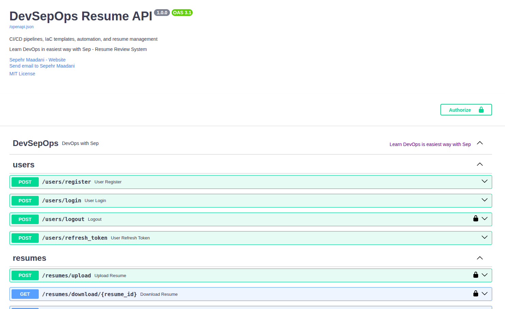
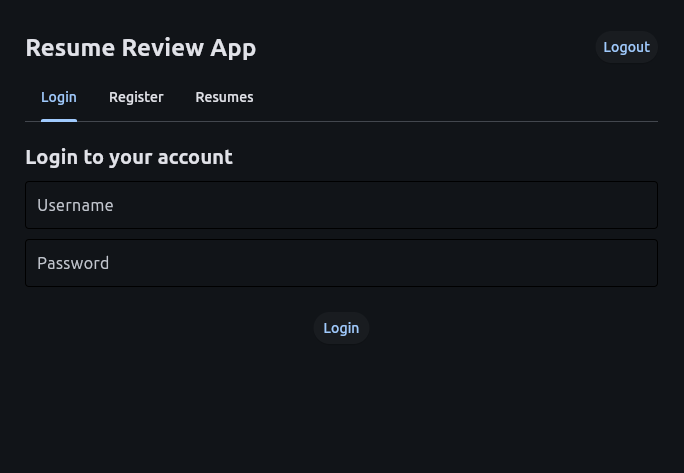
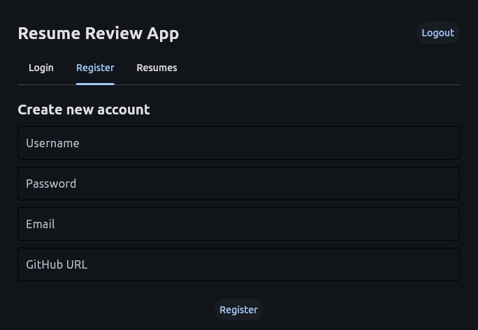
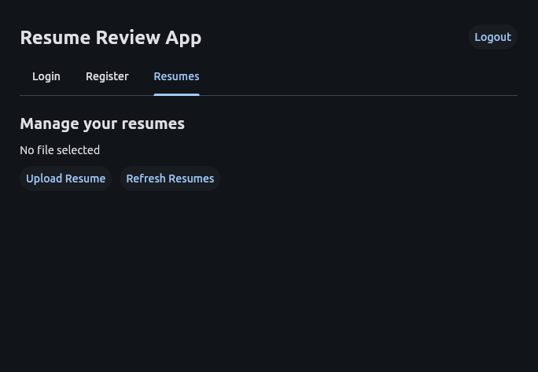

# ResumeReview
<p align="center">
  
</p>
<p align="center">
  
  
  
  
</p>
A modern full-stack project to upload, manage, and review CVs/resumes, showcasing DevOps, backend, frontend, infrastructure, and observability best practices.

**Technologies:**
<p align="center">
  
  
  
  
  
  
  
  
  
  
  
  
  
  
</p>

## ✨ What it does

- **Candidates** register, upload PDF resumes (validated by content, max 10 MB), and list, download or delete them.
- **Experts** review every uploaded resume.
- **Admins** manage roles and account activation, and see platform stats. The first admin is created with a CLI, not an HTTP route.
- Animated Flet UI: a twinkling-particle login and a gradient navigation bar that adapts to the user's role.

## 🏗 Architecture

```
Internet ─► Traefik v3 (TLS, rate limits, secure headers)
              ├─► frontend  (Flet web, per-session state, server-side tokens)
              │        └─────────► backend (FastAPI, Lich architecture) ─► PostgreSQL 16
              └─► backend   (public API)            └─ uploads volume
optional: Metricbeat → Logstash → Elasticsearch ← Grafana  ·  Portainer
```

Full picture: [docs/architecture/system-overview.md](docs/architecture/system-overview.md).
Interface contract (API, environment variables, ports, images): [docs/architecture/contracts.md](docs/architecture/contracts.md).

## 📂 Repository layout

```
backend/                FastAPI — app/{cmd,internal/{entities,services,ports,adapters,dto,validators},api/http,pkg}
  migrations/           Alembic
frontend/               Flet — src/{app,config,shared,features/{auth,resumes,review,admin}}
deployments/
  docker/               docker-compose.yml, Dockerfiles, Traefik (proxy/), monitoring/
  swarm/                docker-stack.yml (+ monitoring stack)
  helm/resume-review/   Kubernetes chart
infra/
  terraform/            modules (aws/azure network + compute), envs/dev, envs/dev-azure
  ansible/              roles common, docker, app_deploy
  sandbox/              Vagrant dev VM
docs/                   architecture, features, runbooks, troubleshooting, onboarding
agentlog.md             change log
```

## 🚀 Quick start

```bash
# tests
cd backend  && pip install -r requirements-dev.txt && pytest
cd frontend && pip install -r requirements-dev.txt && pytest

# full stack
cd deployments/docker
cp .env.example .env                                   # replace every CHANGE_ME
cp proxy/secrets/htpasswd.example proxy/secrets/htpasswd
docker compose up -d --build                           # add --profile monitoring --profile ops for extras
docker compose exec backend python -m app.cmd.create_admin --username admin --email admin@example.com
```

Local setup without real DNS: [docs/onboarding/dev-setup.md](docs/onboarding/dev-setup.md).

## 📦 Deploy

| Target | Guide |
|--------|-------|
| Single VM (Docker Compose) | [docs/runbooks/infra/compose-deploy.md](docs/runbooks/infra/compose-deploy.md) |
| Docker Swarm | [docs/runbooks/infra/swarm-deploy.md](docs/runbooks/infra/swarm-deploy.md) |
| Kubernetes (Helm) | [docs/runbooks/infra/helm-deploy.md](docs/runbooks/infra/helm-deploy.md) |
| New VM on AWS/Azure (Terraform + Ansible) | [docs/runbooks/infra/provision-vm.md](docs/runbooks/infra/provision-vm.md) |
| CI/CD (GitHub Actions, tag → deploy) | [docs/runbooks/infra/ci-cd.md](docs/runbooks/infra/ci-cd.md) |

## 🤝 Contributing

Read [docs/onboarding/contribution-guide.md](docs/onboarding/contribution-guide.md): update the contract first, respect the layering rules, add tests and docs with every change, and log it in `agentlog.md`.

## 📄 License & Contact

- License: MIT  
- Maintainer: Sepehr Maadani - sepehrmaadani98@gmail.com  
- Feel free to use or adapt this for your own portfolios or refer to this as a sample DevOps setup  

